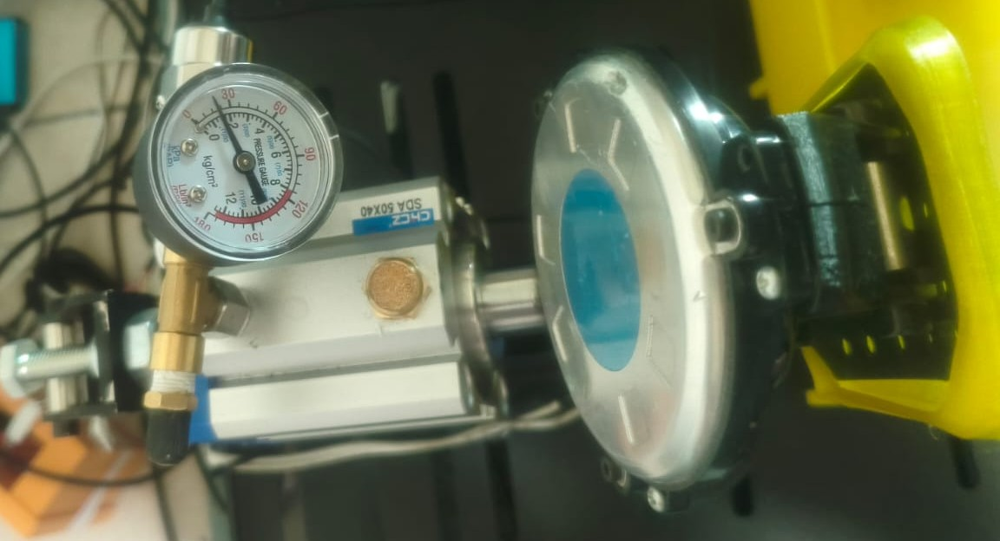
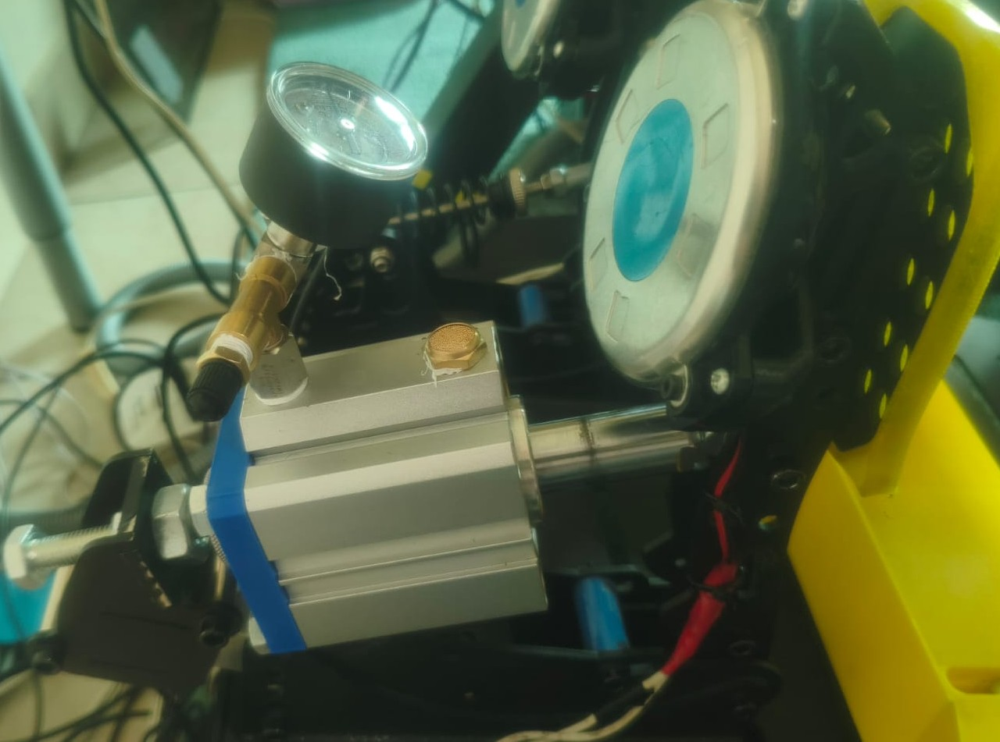
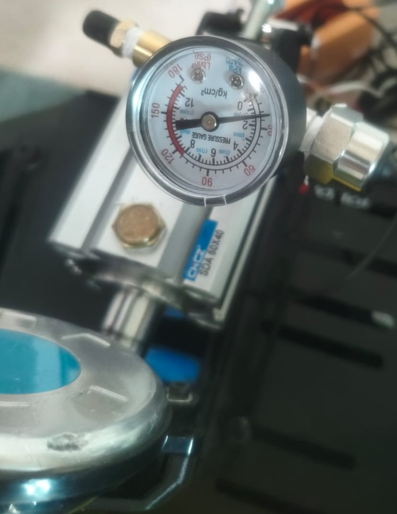

# Jack Pedal

ESP32-S3 pneumatic brake controller using an ADS1220 and a 3.3 V, 0.4-2.4 V, 0-10 bar pressure sensor.

## Build photos

## Files

- `JackPedal_PC/`: Arduino firmware and bundled ADS1220 library.
- `JackPedalControl.exe`: Windows calibration app.
- `JackPedalControl.cs`: app source; run `Build-Windows-App.ps1` to rebuild on Windows with the .NET Framework compiler.
- `Documentation/`: setup instructions and wiring PDF.
- `Enclosure/`: prototype 108 x 108 x 50 mm enclosure, STL files and editable OpenSCAD source. Read its fit limitations before printing.

## Wiring

| ESP32-S3 | ADS1220 |
| --- | --- |
| 3V3 | AVDD, DVDD, REFP0 |
| GND | AGND/AVSS, DGND, REFN0, CLK |
| GPIO10 | CS |
| GPIO9 | DRDY |
| GPIO13 | SCLK |
| GPIO12 | MISO/DOUT |
| GPIO11 | MOSI/DIN |

Sensor power goes to 3V3, ground to common GND, and signal directly to AIN1. No signal divider. CLK and SCLK are different pins.

## Arduino settings (N16R8)

ESP32S3 Dev Module; Flash 16 MB; QIO 80 MHz; OPI PSRAM; USB-OTG (TinyUSB).
Disable USB CDC, MSC and DFU On Boot. Upload through the COM socket.
Keep all files in `JackPedal_PC/` together when opening the sketch.

## Use

Close Serial Monitor before opening the Windows app. Select the current COM port and connect.
Capture MIN with the pedal released, then capture MAX while holding the desired full-brake pressure steady.
Bottom and top deadzones each support 0-25%; click Apply to save them on the controller.
Defaults are 2% bottom and 8% top: full brake begins at 92% of the calibrated range.
Pressure readings remain independent of calibration and deadzones.
Connect the native USB socket to the PC for game-controller input; the brake uses the Y axis.

## Validation status

Sensor readings and USB gamepad detection were confirmed by the user before the deadzone update.
The Windows app builds and its parser/calibration tests pass. Deadzone arithmetic was checked independently.
The latest firmware includes a fix for Arduino custom-type prototype ordering and still needs a successful user compile/upload and pedal test.
The enclosure is a fit-check prototype; its mesh edges were checked but physical fit is unverified.

## Credits

Based on the Jack-Pneumatic project by LandoCode89.
The bundled ADS1220_WE library was written by Wolfgang (Wolle) Ewald; its source notices are retained.
No new license is assigned by this upload preparation.
